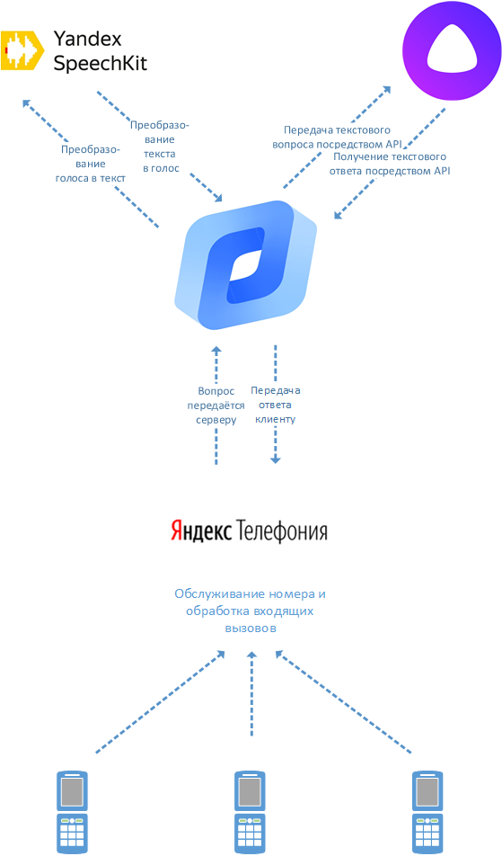

# Алиса по телефону

## Концепция

Сейчас Алиса живёт в большинстве смартфонов и компьютеров русскоязычной аудитории интернета. Но иногда случаются ситуации, когда ответ на некоторый вопрос узнать очень нужно, а доступа в интернет нет. Если бы Алисе можно было бы позвонить - ответ на большинство вопросов можно было бы получить в любой ситуации.

## Актуальность

Согласно [исследованию аналитической компании GfK](https://www.gfk.com/ru/press/issledovanie-gfk-proniknovenie-interneta-v-rossii), проведённому в **2019** году, четверть населения России до сих пор не пользуется интернетом. Так же, согласно [собственным исследованиям Яндекса](https://yandex.ru/company/researches/2016/ya_internet_regions_2016), 38% населения России до сих пор не имеют доступ в интернет. Безусловно, эти люди - жители отдалённых регионов, где доступа в интернет нет до сих пор. Тем не менее, у жителей сёл и дальних уголков страны бытовых вопрсов, за ответами на который городской житель привык обращаться к Алисе или поисковым системам, возникает не меньше. Для большинства отдалённых от городских поселений сёл единственным способом связи с цивилизацией является общественный таксофон - один на всё село.

> За пределами Московской или Ленинградской области интернет становится нестабильным, поймать его можно не везде. Если бы Алисе можно было бы позвонить и задать вопрос - жителям агломераций, покидающим её пределы, было бы так же удобно обращаться к привычной им информационной среде.

## Почему Яндекс?

Яндекс обладает всеми необходимыми технологиями для создания телефонного голосового помощника.

* Виртуальная АТС **Яндекс.Телефония** может обслуживать номер телефона Алисы.
* Yandex Compute Cloud **Яндекс.Облака** может выступать в роли сервера-обработчика данных.
* Технологии **Yandex SpeechKit** способны преобразовать вопрос пользователя в текст, а текст - в голос Алисы.
* **Яндекс.Алиса** умеет давать краткие ответы на вопросы. **На этом навыке Алисы и будет основываться телефонный голосовой помощник.** Общение с Алисой будет произоводиться при помощи **API Алисы**.
* Возможно применение закрытого **API поиска** для получения ответа на вопросы, с которыми Алиса не может справиться самостоятельно.

## Реализация

  

*Основано на реальных ответах Алисы*

> \- когда сажать клубнику
>
>\- Высадка клубники может производиться весной или же в начале осени. Лучше проводить ее как можно раньше, ведь, если вы упустите момент, рассада легко может погибнуть. Весной клубника высаживается в апреле-мае, когда на улице еще не совсем жарко.
>
>
>\- мам
>\-сас